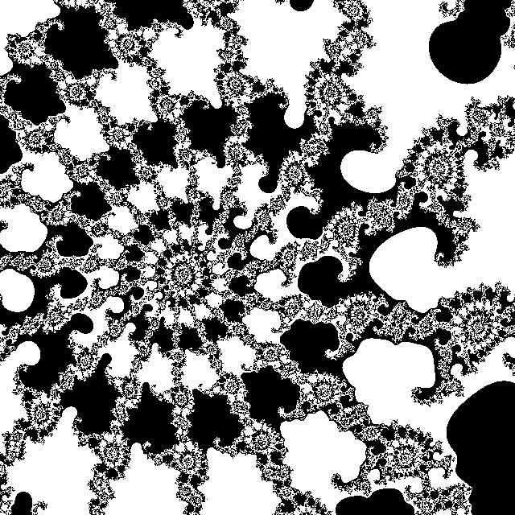
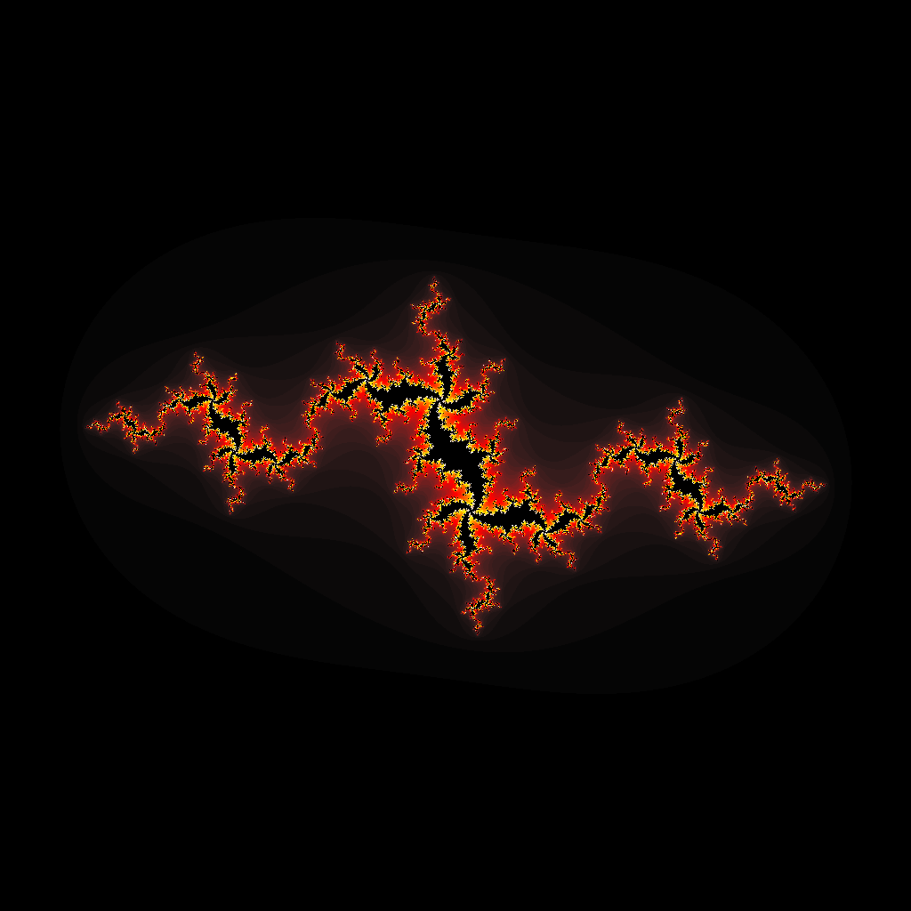
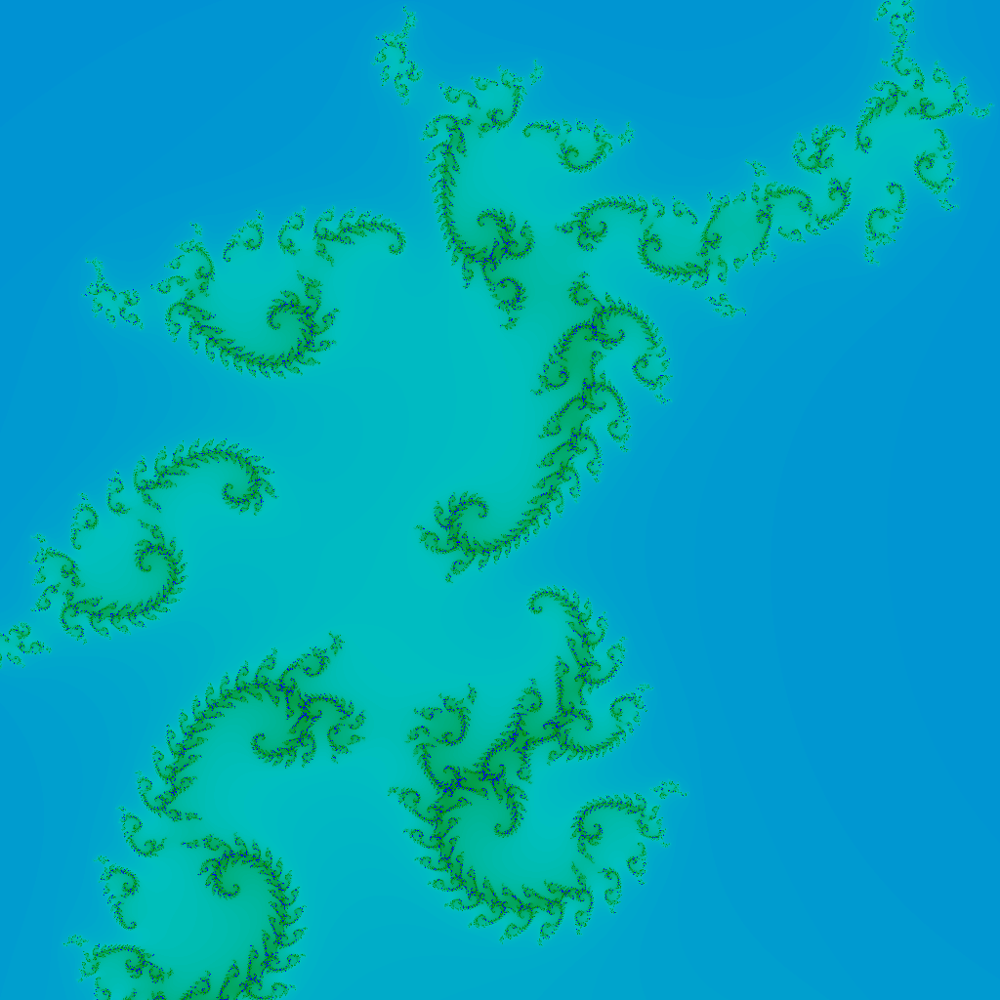
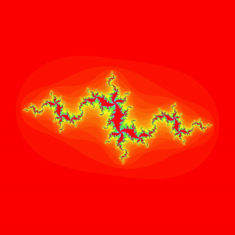

# Fractalizer

A Python-based fractal generator supporting multiple fractal sets with animation capabilities.

## Example Output

<div align="center">

### Static Fractals

| Mandelbrot Set | Julia Set | Phoenix Set |
|:---:|:---:|:---:|
|  |  |  |
| `m-wholly-squid.frac` with `stripes` palette | `j-basic.frac` with `fire` palette | `p-oriental-dragons.frac` with `bluegreen` palette |

### Animation Example

| Fractal Animation |
|:---:|
|  |
| Dynamic fractal animation showing parameter interpolation |

</div>

## Quick Start

Generate a basic fractal:
```bash
poetry run python main.py
```

Generate with a specific configuration:
```bash
poetry run python main.py data/m-basic.frac fire
```

## Installation & Setup

<details>
<summary><strong>System Requirements</strong></summary>

- Python 3.8.1 or higher
- tkinter GUI support (usually included with Python)

**Installing tkinter on Linux (if needed):**
```bash
# Ubuntu/Debian
sudo apt-get install python3-tk

# Fedora/RHEL/CentOS
sudo dnf install tkinter

# Arch Linux
sudo pacman -S tk
```
</details>

<details>
<summary><strong>Python Dependencies</strong></summary>

**Recommended: Using Poetry**
```bash
# Install basic dependencies
poetry install

# Install with animation support
poetry install --with animation
```

**Alternative: Manual Installation**
```bash
# Basic requirements
pip install colour pygame

# Animation requirements (optional)
pip install opencv-python numpy pillow imageio
```
</details>

## Usage

<details>
<summary><strong>Basic Commands</strong></summary>

**Default fractal (Phoenix):**
```bash
poetry run python main.py
```

**Specify configuration file:**
```bash
poetry run python main.py data/m-basic.frac
```

**With color palette:**
```bash
poetry run python main.py data/m-basic.frac fire
```

**Headless mode (no GUI):**
```bash
poetry run python main.py data/m-basic.frac --no-gui
```
</details>

<details>
<summary><strong>Available Fractal Types</strong></summary>

Configuration files are located in the `/data` folder:

- **m-*** - Mandelbrot fractals
- **j-*** - Julia fractals  
- **p-*** - Phoenix fractals
- **bs-*** - Burning Ship fractals
- **bsj-*** - Burning Ship Julia fractals

**Examples:**
- `data/m-basic.frac` - Basic Mandelbrot set
- `data/j-basic.frac` - Basic Julia set
- `data/p-monkey-knife-fight.frac` - Phoenix fractal
- `data/bs-basic.frac` - Burning Ship fractal
</details>

<details>
<summary><strong>Color Palettes</strong></summary>

Available palettes to use as the second argument:

- **default** - Standard rainbow colors
- **rainbow** - Full rainbow spectrum
- **fire** - Flame colors
- **bluegreen** - Blue and green spectrum
- **stripes** - Black and white
- **christmas** - Red and green colors

**Example:**
```bash
poetry run python main.py data/m-basic.frac christmas
```
</details>

## Animation Features

<details>
<summary><strong>Animation Setup</strong></summary>

Animation requires additional dependencies:
```bash
poetry install --with animation
```

**Note:** FFmpeg is recommended for best video quality but the system will fall back to Python libraries if unavailable.

**Automatic Duration Adjustment:** All animations are automatically ensured to be at least 5 seconds long. If your frame count and FPS would result in a shorter animation, the FPS will be automatically reduced to achieve the minimum duration.
</details>

<details>
<summary><strong>Animation Parameters</strong></summary>

Animate these fractal parameters:

- **centerx** / **centery** - Pan across the fractal plane
- **axislength** - Zoom in or out
- **creal** / **cimag** - Julia set constants (Julia fractals)
- **preal** / **pimag** - Phoenix fractal constants (Phoenix fractals)

**Basic syntax:**
```bash
poetry run python main.py [config] [palette] --animate \
    --parameter [param] --start [value] --end [value] --frames [count]
```
</details>

<details>
<summary><strong>Interpolation Methods</strong></summary>

Control how parameter values change over time:

- **linear** - Constant rate of change (default)
- **ease-in-out** - Smooth acceleration and deceleration
- **sine-wave** - Oscillating motion
- **back-and-forth** - Go from start to end and back

**Example:**
```bash
poetry run python main.py data/m-basic.frac fire --animate \
    --parameter axislength --start 4.0 --end 0.1 --frames 60 \
    --interpolation ease-in-out
```
</details>

<details>
<summary><strong>Animation Examples</strong></summary>

**Basic zoom animation:**
```bash
poetry run python main.py data/m-basic.frac fire --animate \
    --parameter axislength --start 4.0 --end 0.1 --frames 60
```

**Smooth panning animation:**
```bash
poetry run python main.py data/j-basic.frac rainbow --animate \
    --parameter centerx --start -2.0 --end 2.0 --frames 120 \
    --interpolation ease-in-out --fps 30
```

**Julia constant morphing:**
```bash
poetry run python main.py data/j-basic.frac christmas --animate \
    --parameter creal --start -1.0 --end 1.0 --frames 90 \
    --interpolation sine-wave --quality high
```

**High quality oscillating zoom:**
```bash
poetry run python main.py data/m-basic.frac fire --animate \
    --parameter axislength --start 2.0 --end 0.01 \
    --interpolation back-and-forth --quality lossless --fps 60
```
</details>

## Output & Execution

<details>
<summary><strong>Program Output Examples</strong></summary>

**GUI Mode:**
```
Rendering phoenix fractal
[100% =================================]
Done in 2.430 seconds!
Close the image window to exit the program
```

**Headless Mode:**
```
Rendering mandelbrot fractal
[100% =================================]
Done in 1.911 seconds!
Image saved to ./output/mandelbrot.png
```

**Animation Mode:**
```
Starting animation generation: AnimationConfig(frames=60, parameter='axislength', range=4.0→0.1, output='zoom')
Generated 60 interpolated values
Generating frame 60/60 (axislength=0.100000)
Generated 60 frame images
Video successfully created: ./output/zoom.mp4
Cleanup complete: 60 files removed
Animation complete: ./output/zoom.mp4
```
</details>

<details>
<summary><strong>Performance Tips</strong></summary>

- Use `--no-gui` for faster generation when preview isn't needed
- Use lower frame counts for testing animations
- Use 'low' quality setting for preview animations  
- Higher iteration counts create more detail but take longer to render
- Test with small parameter ranges before creating long animations
- All animations are automatically at least 5 seconds long for better visibility
</details>

## Troubleshooting

<details>
<summary><strong>Common Errors & Solutions</strong></summary>

| Error | Message | Solution |
|-------|---------|----------|
| **File Not Found** | `FileNotFoundError: [Errno 2] No such file or directory` | Verify file paths are correct |
| **Incorrect Fractal Type** | `Warning! incompatible fractal type detected` | Use correct fractal configuration file |
| **Invalid Palette** | `ValueError: Unknown palette name` | Use valid palette names listed above |
| **Animation Dependencies** | `ImportError: Animation dependencies not installed` | Run `poetry install --with animation` |
| **Video Creation Failed** | `All video creation methods failed` | Install ffmpeg or ensure Python video libraries are available |
| **Invalid Parameter** | `ValueError: Invalid parameter` | Use valid parameters: centerx, centery, axislength, creal, cimag, preal, pimag |
| **Missing Configuration** | `File not found in data directory` | Ensure fractal configuration file exists in `/data` folder |
</details>

<details>
<summary><strong>Getting Help</strong></summary>

**View available options:**
```bash
poetry run python main.py --help
```

**List available fractal configurations:**
```bash
ls data/*.frac
```

**Test basic functionality:**
```bash
poetry run python main.py data/m-basic.frac --no-gui
```
</details>
